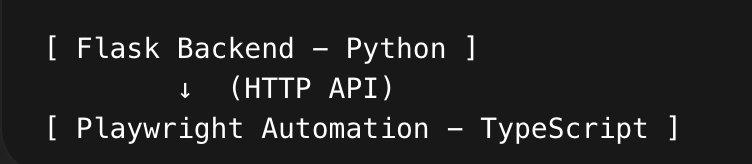

# Copilot Training Demo

This repository is created fully using GitHub Copilot.  

# Architecture Overview

This project consists of two independent layers:
1️⃣ book_api/                 → Flask Backend (Python)
2️⃣ copilot-training-demo/    → Playwright Automation (TypeScript)

And visually:

1. Originally, the API was developed using Python (Flask).
2. The automation framework has been migrated to: <TypeScript + Playwright>
3. This demonstrates how automation can be built independently of backend implementation language.
        ## Backend: Python
        ## Automation: TypeScript
4. This separation ensures scalability and flexibility in enterprise environments.

# Backend Setup (Python – Flask)

1. Navigate to backend folder: <cd book_api>
2. Create virtual environment: <python3 -m venv venv>
3. Activate environment: <source venv/bin/activate>
4. Install dependency: <pip install -r requirements.txt>
5. Run backend: <python3 run.py>

Backend runs on: <http://localhost:5000>

# Automation Setup
1. Navigate to automation folder: <cd copilot-training-demo>
2. Install dependencies: <npm install>
3. Run tests: <npx playwright test>

# Before running npx playwright test, ensure the Flask backend is running.